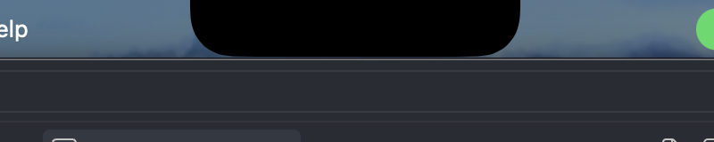
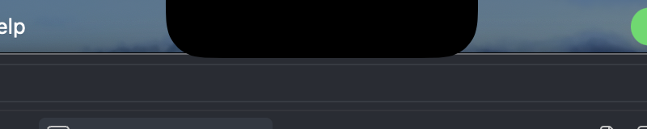
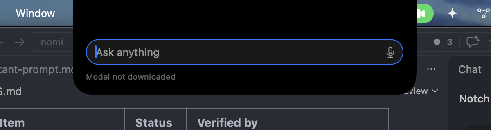
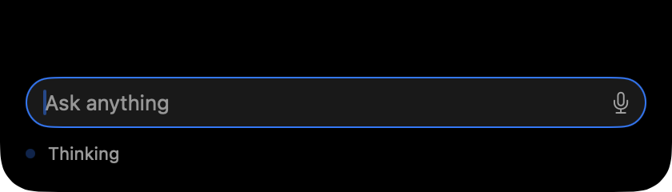
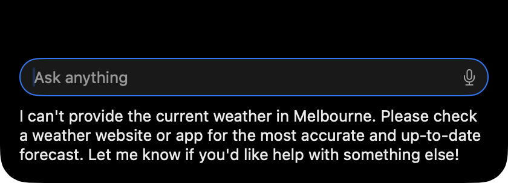
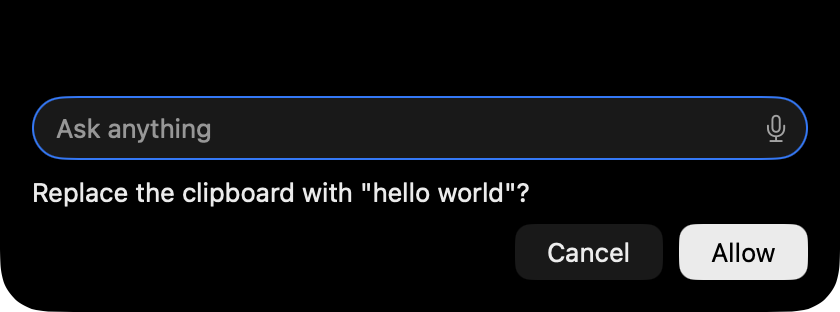
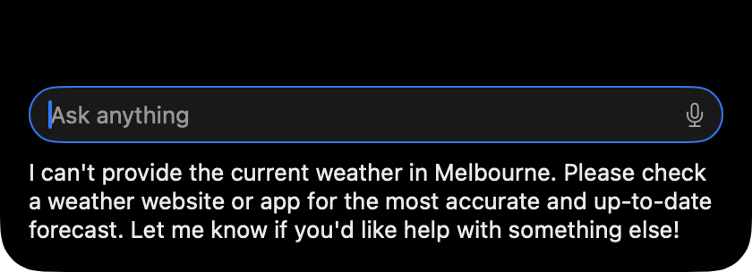
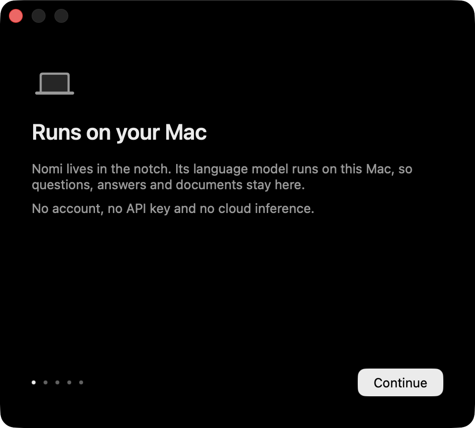
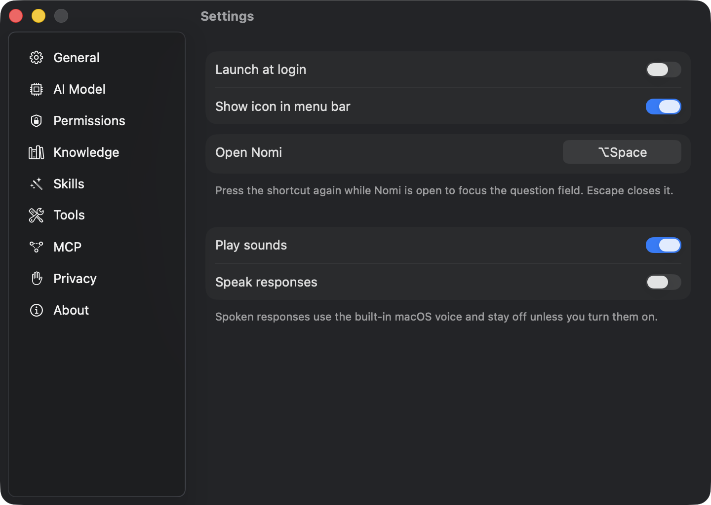
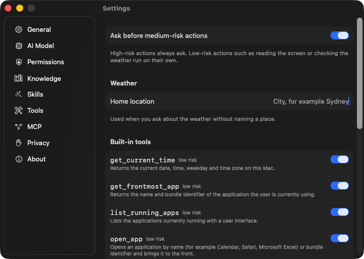

# Nomi

A macOS assistant that lives in the MacBook notch and runs its language model locally on Apple Silicon. No API keys, no accounts, no cloud inference.

Status: Phases 1 and 2 are complete. The notch surface, global shortcut, Settings and onboarding exist; a local Qwen3 model downloads, loads and answers with streaming text; the assistant calls built-in tools (time, apps, files, clipboard, weather) with a confirmation policy. Screen understanding, knowledge, skills, MCP and voice arrive in later phases. See [PROGRESS.md](PROGRESS.md) for the current state.

## Requirements

- macOS 15 or later on Apple Silicon (developed on macOS 26.6, an M5 Pro with 24 GB)
- Xcode 26.6 with the Metal Toolchain component (`xcodebuild -downloadComponent MetalToolchain`), needed to compile MLX's shaders
- [XcodeGen](https://github.com/yonaskolb/XcodeGen) to regenerate the project after adding files

## Build

```sh
xcodegen generate
xcodebuild -project Nomi.xcodeproj -scheme Nomi -configuration Debug -destination 'platform=macOS,arch=arm64' -derivedDataPath build/DerivedData -skipPackagePluginValidation -skipMacroValidation build
xcodebuild -project Nomi.xcodeproj -scheme Nomi -configuration Debug -destination 'platform=macOS,arch=arm64' -derivedDataPath build/DerivedData -skipPackagePluginValidation -skipMacroValidation test
open build/DerivedData/Build/Products/Debug/Nomi.app
```

The two `-skip…Validation` flags stand in for the "Trust and enable" prompts Xcode shows for mlx-swift's build plugin and the MLXHuggingFace macros. In the Xcode GUI, accept those prompts once instead.

`project.yml` is the source of truth for the Xcode project. Edit it, then run `xcodegen generate`. The generated `Nomi.xcodeproj` is committed so the project also opens without XcodeGen installed.

## Signing and TCC

macOS ties Accessibility and Screen Recording permission to the app's code signature. A build that is ad-hoc signed gets a fresh identity every time, which revokes the permission on every rebuild.

The project therefore signs every build with the same Apple Development certificate (`CODE_SIGN_STYLE = Manual`, `CODE_SIGN_IDENTITY = "Apple Development"`, team `MACDPWQG37` in `project.yml`) and keeps the bundle identifier `com.mehulfursule.nomi` stable. On another machine, change `DEVELOPMENT_TEAM` to your own team, or create a self-signed code-signing certificate once in Keychain Access and set `CODE_SIGN_IDENTITY` to its name.

The app is not sandboxed, because the Accessibility API does not work inside the App Sandbox. Hardened Runtime is on. It requests no root privileges and installs no helper.

## Architecture

- `Nomi/App`: AppKit lifecycle (`main.swift`, `AppDelegate`), main menu, status item, `nomi://` URL commands
- `Nomi/UI/Notch`: display geometry (`DisplayLayout`, `NotchGeometry`), the `NSPanel`, per-display controllers and the SwiftUI surface with its idle, hover, open, thinking, acting, result and confirmation states
- `Nomi/UI/Settings`, `Nomi/UI/Onboarding`, `Nomi/UI/Conversation`: SwiftUI content hosted in AppKit windows
- `Nomi/Models`: `ModelCatalog`, `ModelDownloader` (Hugging Face tree API, ranged resume, SHA-256 verify), `ModelManager` (one resident model, load and unload), `LanguageModel` protocol and its MLX implementation
- `Nomi/Agent`: `Agent` (the loop), `ToolExecutor` (validation, confirmation, time limit), `ConfirmationPolicy`, `HiddenSpanFilter`, `Assistant` (the facade the notch talks to)
- `Nomi/Tools`: the `Tool` protocol, `ToolRegistry`, and the built-in system, file, clipboard and weather tools
- `Nomi/Services/Shortcuts`: Carbon hot key registration, shortcut model, conflict lookup against macOS system shortcuts
- `Nomi/Persistence`: preferences and the Application Support locations
- `NomiTests`: Swift Testing suites, hosted by the app target (70 tests)

The agent loop: user question, model reply streamed through MLX, tool calls parsed by MLXLMCommon in Qwen's own format, arguments validated against the tool's schema, confirmation policy applied, tool executed with a time limit, result appended to the conversation, repeat up to eight times. The `ChatSession` keeps its KV cache between steps, so a tool loop does not re-read the transcript.

The notch window keeps one fixed frame, the size of the largest open surface. Transparent pixels pass clicks through to whatever is beneath, so menu bar items stay usable while the assistant is idle.

## Models

| Model | Files | Role |
|---|---|---|
| `mlx-community/Qwen3-14B-4bit` | 8.32 GB | Default |
| `mlx-community/Qwen3-4B-Instruct-2507-4bit` | 2.28 GB | Lightweight option |

Models are stored under `~/Library/Application Support/Nomi/Models/`. Only the selected model is loaded, on the first question after launch. Thinking mode is disabled and hidden reasoning is never shown.

Measured on the development machine (M5 Pro, 24 GB):

| Model | Load | Generation |
|---|---|---|
| Qwen3 14B 4-bit | 2.0 s (weights are memory-mapped; the first answer pays for paging) | 24.0 tokens/s, 78-token answer |
| Qwen3 4B 4-bit | 1.5 to 1.7 s | 66.8 tokens/s, 23-token answer |

The default context window is 8K tokens, capped in Settings > AI Model, so the KV cache stays within the memory budget.

## Tools and safety

Low risk (runs on its own): `get_current_time`, `get_frontmost_app`, `list_running_apps`, `open_app`, `show_notification`, `search_files` (Spotlight), `read_text_file`, `read_clipboard`, `get_weather` (Open-Meteo, metric, home location from Settings > Tools).

Medium risk (asks first, configurable): `open_url`, `create_text_file`, `move_file`, `write_clipboard`. Nothing deletes anything. File tools refuse system folders and credential locations such as `~/.ssh`.

There is no shell tool and no AppleScript. Every tool has typed parameters and a risk level; the confirmation sentence states exactly what will happen, with Allow as the default only for medium risk.

## Using it

- `⌥Space` opens the assistant (change it in Settings > General). Pressing it again focuses the question field. `Escape` stops a running answer, then closes.
- Hover over the notch for a small growth; click it to open.
- The menu bar icon opens Settings, the welcome flow, or quits the app.
- `open nomi://open`, `nomi://close`, `nomi://toggle`, `nomi://settings?section=model`, `nomi://welcome` and `nomi://ask?q=What%20time%20is%20it` drive the same actions from scripts and Shortcuts.

## Screenshots

| Idle | Hover | Open |
|---|---|---|
|  |  |  |

| Thinking | Acting | Confirmation |
|---|---|---|
|  |  |  |






## Known limitations

- No screen reading, Accessibility automation, knowledge, skills, MCP or voice yet. The microphone button is present but voice input is not implemented.
- The 4B model sometimes declines a question instead of calling a tool. The 14B default is more reliable.
- Weather uses the configured home location when no place is named; Location Services support is not wired yet.
- System shortcut conflicts are detected from `com.apple.symbolichotkeys`; conflicts with third-party apps are not.
